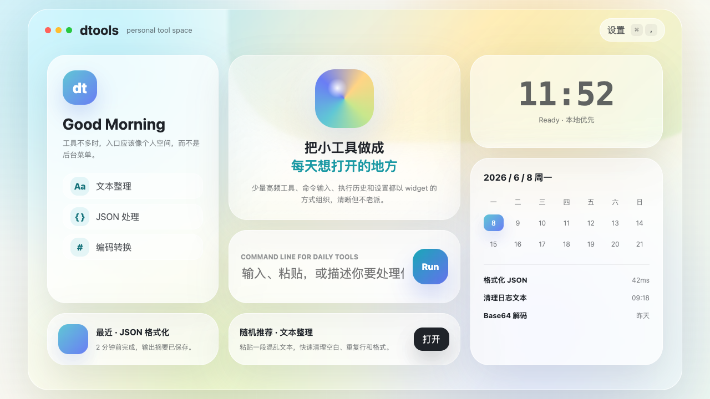
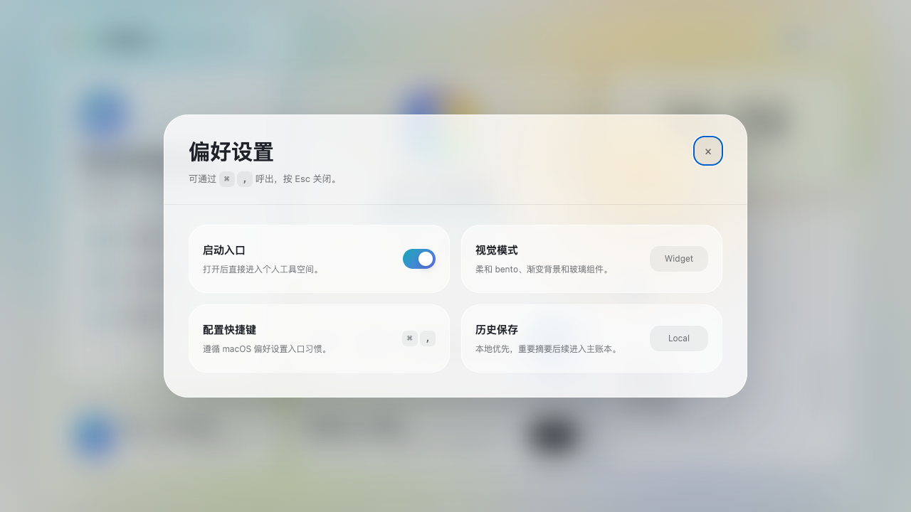

# macOS 工具 App 概念稿

## 预览文件

- HTML 预览：`docs/previews/mac-tool-app-concept.html`
- 主界面截图：`docs/previews/mac-tool-app-concept-main.png`
- 设置弹窗截图：`docs/previews/mac-tool-app-concept-settings.png`

## 截图

## 设计定位

- 面向 macOS 的个人工具工作台，后续可延展到 iOS 和 Web。
- 首屏展示真实 App 工作区，不做营销首页。
- 视觉方向改为柔和 bento / widget 个人空间：参考 YYsuni 这类新式个人主页排版，用大圆角组件、柔和渐变背景、轻玻璃层和错落但对齐的网格组织少量工具。
- 主界面取消老式 tab 和后台式侧栏，保留顶部品牌、右上角设置、个人工具卡、中心命令卡、时间状态、运行日历和最近记录。

## 当前交互

- 点击左下角「偏好设置」按钮可打开配置弹窗。
- 在 macOS 浏览器中按 `Command + ,` 可呼出配置弹窗。
- 按 `Esc` 或点击弹窗外区域可关闭弹窗。

## 注意

- 当前文件是界面效果展示稿，不是正式前端工程。
- 文本整理、JSON 格式化、Base64 编解码等工具为 demo 示例，不代表最终工具清单。
- 后续进入正式实现前，需要先确认真实工具范围、前端工程结构和 Tauri / Web / iOS 的阶段切片。
